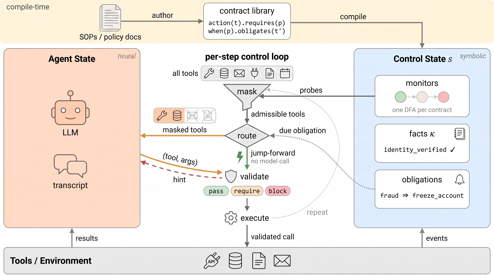

# ACORN

ACORN (**Agent Contract Orchestration for Runtime Navigation**) is a
neuro-symbolic agent harness: it compiles assume-guarantee contract
libraries into runtime control for LLM agents. On all ten domains of
Amazon SOP-Bench it raises macro-average task success from **71.4% to
94.5%** with **zero committed procedure violations**, at **lower cost
than the unguarded baseline**, and the same contract libraries transfer
unchanged across all five models evaluated (GPT-5-mini, Claude 4.5
Haiku and Sonnet, gpt-oss-120B, Llama-3.3-70B).

> The agent chooses when there is freedom. ACORN executes when there isn't.

> **Research framing.** ACORN is the *control* sibling of
> [ContrAgent](https://github.com/yfxiao16/ContrAgent): ContrAgent
> supervises an agent's tool calls, observing and vetoing at the action
> boundary, while ACORN turns the same contracts into the action space
> itself, masking what the model may do, executing what the procedure
> determines, and scheduling what must follow. Same substrate,
> assume/guarantee contracts over the tool-call trace, moved from
> checking to control.

> 📄 **Paper:** coming soon; the link will be added here on release.

<p align="center">
  
</p>

## How ACORN works

A procedure is declared once, as contracts over the agent's tool-call
trace. At runtime the harness walks their joint monitor state as a
residual policy graph: each node carries the set of admissible actions
and, when only one remains, the action itself. Four mechanisms read
this graph:

- **Dynamic tool masking.** At every step the model sees only the
  contract-admissible subset of tools, at `step`, `phase`, or `hint`
  granularity.
- **Symbolic jump-forward.** When exactly one admissible action remains
  with deterministically bindable arguments, or an obligation falls due,
  the controller executes it with no model call.
- **Hard validation.** Every concrete call crosses a pre-execution
  boundary; recoverable blocks name the missing prerequisite.
- **Active obligations.** Prescriptive duties ("after X you must do Y")
  are scheduled and executed, not merely detected after the fact.

ACORN is a complete harness rather than a layer bolted onto another
framework, and that follows from the guarantee rather than from
packaging: compliance holds because every executed action, whether the
model proposed it or the controller scheduled it, crosses the same
validation boundary. Tools, the optional flow, and the contract library
are declared to ACORN, and it drives the loop.

Five words carry the whole design. A **contract** is one rule about the
tool-call trace ("issue_refund requires identity_verified"). A **fact**
is something a tool result established ("identity_verified"). An
**obligation** is a duty a fact creates ("once fraud is detected, freeze
the account"). **Masking** hides the tools the contracts currently
forbid. **Jump-forward** executes the step when the contracts leave
exactly one legal move, without asking the model.

## Results

The headline numbers are macro-averages over the ten domains' full
labeled dev sets (1,474 rows), with compliance audited by the same
contract library in observe mode under every condition, so the
accounting does not depend on which controller ran. On τ²-bench retail,
enforcing the policy's own rules costs no outcome performance while
removing committed violations.

Every per-cell number is in [docs/RESULTS.md](docs/RESULTS.md),
including the results that run against the system: the veto-only
condition scores 32.6 points *below* the unguarded baseline on one
domain, masking alone underperforms the baseline on another, and one
domain's ceiling is a judgment the SOP itself assigns to human
experience rather than anything the harness can enforce. Each domain
adapter documents, next to the library it defines, which rules come
from the SOP, which were validated against labeled data, and where
deterministic rules are deliberately not fitted.

## Install

ACORN builds on [ContrAgent](https://github.com/yfxiao16/ContrAgent), the
deterministic contract layer (ALTLf formulas, residual-DFA monitoring,
event grounding). It is not on PyPI yet, so install it first:

```bash
git clone https://github.com/yfxiao16/ContrAgent ../ContrAgent
pip install -e ../ContrAgent
pip install -e ".[dev]"
pytest -q
```

(For development without installing, the repo-root `conftest.py` falls
back to a sibling `../ContrAgent` checkout automatically.)

## Quick start

Three orthogonal declarations: **tools** say what the agent *can* do,
**flow** says how the application *wants* to organize the task, and the
**contract library** says what is *allowed and required*, attached
explicitly and never encoded into the flow.

```python
import acorn

# Needs ANTHROPIC_API_KEY (or use bedrock:/openai:/gemini: with their keys).
# To run ACORN with no credentials at all, see examples/bank_demo.py below.
agent = acorn.Agent(
    model=acorn.models.resolve("anthropic:claude-sonnet-5"),
    instructions="You are a bank service agent.",
)

@agent.tool
def verify_identity(user_id: str) -> dict:
    "Verify the customer's identity."
    return {"verified": True, "user_id": user_id}

@agent.tool
def issue_refund(order_id: str, amount: float) -> dict:
    "Issue a refund for an order."
    return {"refunded": True}

@agent.tool
def freeze_account(user_id: str) -> dict:
    "Freeze the customer's account."
    return {"frozen": True}

library = acorn.ContractLibrary("refund-desk-v1", [
    # REQUIRES: facts that must hold when the action is called
    acorn.action("issue_refund").requires("identity_verified").at_most(1),
    # EVIDENCE: tool results establish facts
    acorn.after("verify_identity").asserts(
        "identity_verified", when=lambda r: r.output.get("verified")
    ),
    # OBLIGATES: what MUST happen once a fact holds (executed by ACORN)
    acorn.when("fraud_detected").obligates(
        "freeze_account",
        binder=lambda ctx: {"user_id": ctx.facts.value("customer_id")},
    ),
])
print(library.verify())   # certificate: each contract satisfiable and
                         # falsifiable, the library conflict-free
agent.attach(library)

result = agent.run("Refund order #123 for customer u1")
print(result.status, result.final_text)
print("symbolic execution ratio:", result.symbolic_execution_ratio)
```

A complete, runnable walkthrough (no API key needed; it uses a scripted
model by default) is [`examples/bank_demo.py`](examples/bank_demo.py):

```bash
python3 examples/bank_demo.py
```

Its fraud scenario shows every mechanism in one trace: a tool result sets
`fraud_detected`, the obligation fires without a model call, and the
model's next proposal is refused before it can execute.

```text
  ── step 2 ────────────────────────────────────────────────
     [masked]        replace_card       replace_card requires identity_verified, ...
     [LLM]           exposed: lookup_customer, verify_identity, check_fraud, ...
                     model proposes -> check_fraud({"customer_id": "C-1024"})
                     executed check_fraud ok=True
                        + fact fraud_checked = True
                        + fact fraud_detected = True
                        ! OBLIGATION: fraud detected: freeze the account immediately

  ── step 3 ────────────────────────────────────────────────
     [JUMP-FORWARD]  freeze_account({'customer_id': 'C-1024'})
                     NO LLM CALL (obligation: fraud detected: freeze the account)
                     executed freeze_account(...) ok=True
                        * obligation satisfied

  ── step 4 ────────────────────────────────────────────────
     [masked]        replace_card       ...; replace_card is forbidden while fraud_detected
     [LLM]           exposed: lookup_customer, verify_identity, check_fraud, ...
                     model proposes -> replace_card({"customer_id": "C-1024"})
     [BLOCKED]       replace_card: replace_card is forbidden while fraud_detected

  summary
     7 steps: 5 LLM calls, 2 executed by the controller with no LLM call (40% of actions)
     1 proposal(s) blocked before execution; 0 committed violation(s), 0 obligation(s) left pending
```

(Verbatim, with the exposed-tool lists elided.) The obligation in step 3
is discharged by the controller with no model call, and in step 4 the
model's forbidden proposal is refused before it can execute.

For staged tasks, `acorn.GraphFlow` exposes a candidate toolset per state
with fact-reactive transitions; the effective toolset at each step is
always `A_eff = A_agent ∩ A_contract`.

## Reproducing the paper's experiments

> **Cost warning:** every benchmark row makes real model calls. Nothing
> runs without an explicit `--model` and a configured API key (via
> `.env`; see `acorn/envfile.py`).

**Amazon SOP-Bench** (10 domains). Obtain the benchmark packs from their
official release and place each under
`benchmarks/amazon_sopbench/data/<domain>_sop/` (the directory is
git-ignored; packs are not redistributed here). Then:

```bash
python3 -m benchmarks.amazon_sopbench.run_pack \
    --pack benchmarks/amazon_sopbench/data/dangerous_goods_sop \
    --model openai:gpt-5-mini \
    --condition acorn \
    --mask-granularity step \
    --out results/mini_dangerous_goods_acorn.json
```

`--condition` is one of `baseline | passive | mask | acorn`, and
`--mask-granularity` one of `step | phase | hint`.

Each domain's adapter (`benchmarks/amazon_sopbench/<domain>.py`)
documents, next to the contract library it defines, which rules are
SOP-derived, which are data-validated, and where deterministic rules are
deliberately not fitted. `--scaffold react` wraps the model in a
text-protocol ReAct loop; `--flow-profile` selects the profiles of the
workflow-to-agent sweep on the domains that support them. Runs
checkpoint per row (`<out>.partial.json`) and resume on relaunch.

**τ²-bench retail.** The adapter in `benchmarks/tau2_acorn/` implements
the benchmark's own agent interface; `run_batch.py` runs the arms
(official / shell / grounded-17 / full-53) under matched conditions.

**Analysis.** `scripts/matrix_table.py` renders the cross-model matrix
(markdown or `--latex`); `scripts/aggregate_results.py`,
`bootstrap_ci.py`, and the other scripts in `scripts/` reproduce the
derived tables. Every number in the paper is transcribed from
[docs/RESULTS.md](docs/RESULTS.md), which is generated from the JSON
cells in `results/`.

## Repository layout

```text
acorn/            the harness: Agent, loop, controller, contracts DSL,
                  flows (FreeFlow/GraphFlow), obligations, residual
                  policy cache, model adapters (openai/anthropic/
                  gemini/bedrock + ReAct wrapper)
benchmarks/       Amazon SOP-Bench adapters (10 domains) and τ²-bench
                  adapter, with their contract libraries
examples/         runnable demo (scripted model, no API key)
scripts/          result aggregation and table generation
results/          per-cell JSON results (the paper's data ledger)
docs/RESULTS.md   every reported number, with provenance notes
docs/DESIGN.md    architecture and the ContrAgent reuse map
tests/            pytest suite (contract semantics, adapters, binders)
```

## Citation

If you use ACORN, please cite the paper (see
[CITATION.cff](CITATION.cff)); a preprint reference will appear here
once available.

## License

[Apache-2.0](LICENSE).
